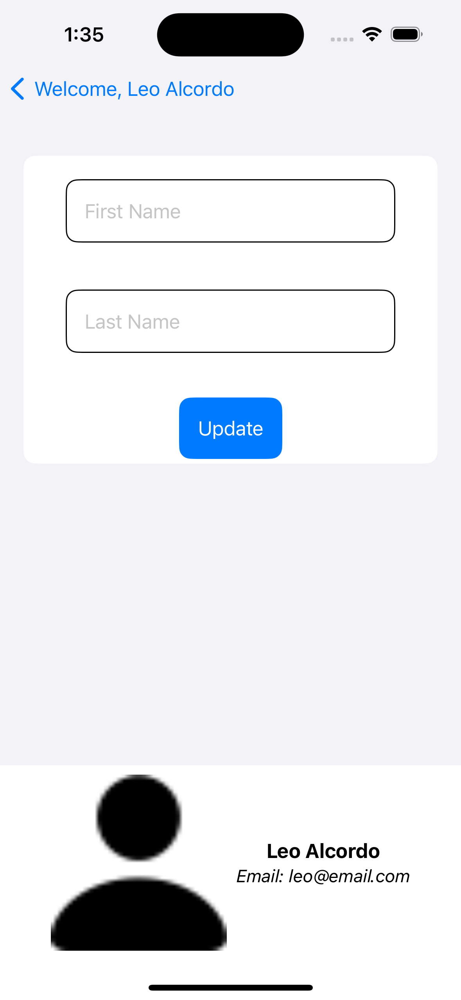
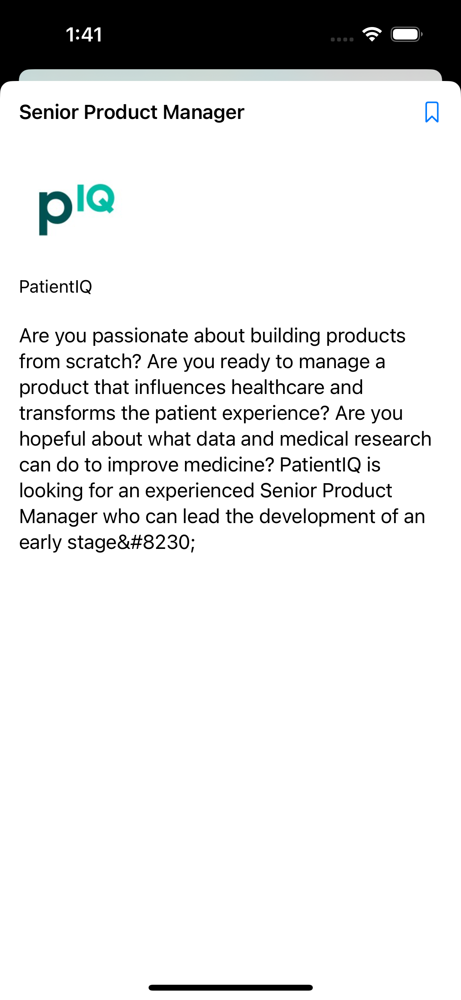

# JobSearch App made in IOS(SwiftUI)

# Features
- Sign up / Sign In as a User/Job Seeker
- Sign out
- Login/SignUp validations when user input is incorrect or fields are empty
- Modifying User Profile (First Name, Last Name, Profile Picture)
- Display available jobs retrieved from API
- MapView and List View
- Filter jobs available based on a Country
- Bookmark a job
- View job details

# Services, Dependancies, and Architecture
- RESTful API
- Firebase firestore
- Firebase Authentication (email and password)
- MVC Architecture Pattern
- MapKit
- SwiftyJSON
- AlamoFire

# Author
- Julius Dejon
- Leo Alcordo
- Gagan Grewal

# Screenshots

